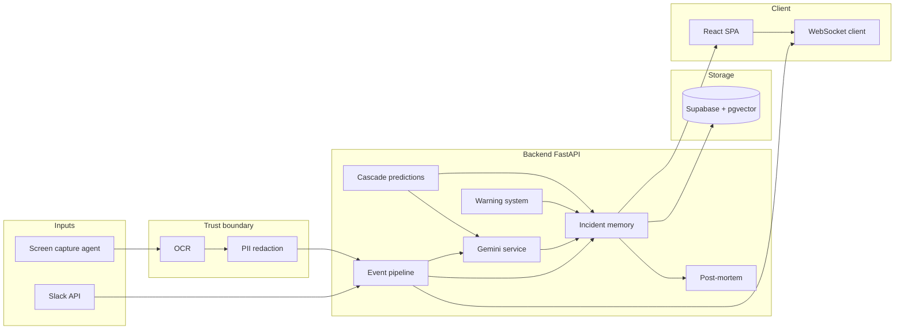

# Incident Brain — architecture

Companion to [`README.md`](../README.md) and [`JUDGING.md`](../JUDGING.md). This document helps reviewers **navigate the codebase** in one pass.

---

## High-level data flow

---

## Request paths (simplified)

### Text event (e.g. Slack or manual)

1. `POST /api/events/text` → `routes/events.py`
2. `EventPipeline.process_text_event` → `services/event_pipeline.py`
3. Gemini extracts structured candidate events → `services/gemini_service.py`
4. Embeddings for memory/search → `services/embedding_service.py`
5. Persist + optional warnings / predictions → `services/incident_memory.py`, `warning_system.py`, `cascade_prediction.py`
6. WebSocket fan-out → `websocket/manager.py`

### Image event (screen)

1. `POST /api/events/image` → privacy pipeline path inside pipeline (OCR + redaction before model) → `services/privacy_pipeline.py`

---

## Directory layout

| Path | Role |
|------|------|
| `backend/app/main.py` | FastAPI app, CORS, router mount |
| `backend/app/routes/` | REST surface area |
| `backend/app/services/` | Core domain logic |
| `backend/app/models/` | Pydantic / domain models |
| `backend/app/websocket/` | Real-time hub |
| `backend/migrations/` | Supabase SQL (run in order) |
| `frontend/src/` | Vite + React UI |
| `agents/` | Long-running local processes (Slack, screen) |
| `docker/` | Compose for backend + static frontend |

---

## Configuration

Single source of truth: `backend/app/config.py` (Pydantic settings, `.env`).

Optional Lobster Trap base URL routes **chat/vision** OpenAI-compatible calls through the proxy; embeddings remain direct per README.

---

## Extension points (for “future work” discussions)

- Swap embedding model in `embedding_service.py`
- Add new event `type` / `source` values via migrations + model enums
- Plug additional listeners beside Slack (PagerDuty, etc.) by mirroring `EventPipeline` entry patterns
